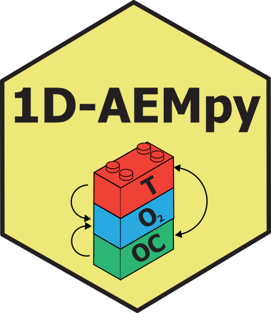

# One-dimensional Aquatic Ecosystem Model in Python (1D-AEMpy)

-----

:busts_in_silhouette: Robert Ladwig, Bennett McAfee, Paul C Hanson
:email: [contact](mailto:ladwigjena@gmail.com)
:computer: [more info](https://www.robert-ladwig.com)

-----

## overview
The modularized framework runs a vertical one-dimensional aquatic ecosystem model (AEM) for water temperature, dissolved oxygen and organic carbon (dissolved and particulate as well as labile and refractory) dynamics using the general equation form of:

$A \frac{\partial C}{\partial t} + w \frac{\partial C}{\partial z} - \frac{\partial}{\partial z}(A K_z \frac{\partial C}{\partial z}) = P(C) - D(C)$

Water temperature and heat transport are simulated using an eddy-diffusion approach in which the turbulent eddy diffusivity coefficients are parameterized based on the gradient Richardson number. To ensure stability, we apply the implicit Crank-Nicolson scheme for the diffusive transport. Production and consumption terms of the water quality dynamics (dissolved oxygen and organic carbon) are simulated using a modified Patankar Runge-Kutta scheme to ensure mass conservation and to prevent unrealistic negative values. Net primary production is acting as a boundary condition based on vertical light limitation, integrated total phosphorus concentrations, and water temperature. Convective wind mixing is parameterized based on an integral energy approach.

<!-- -->
